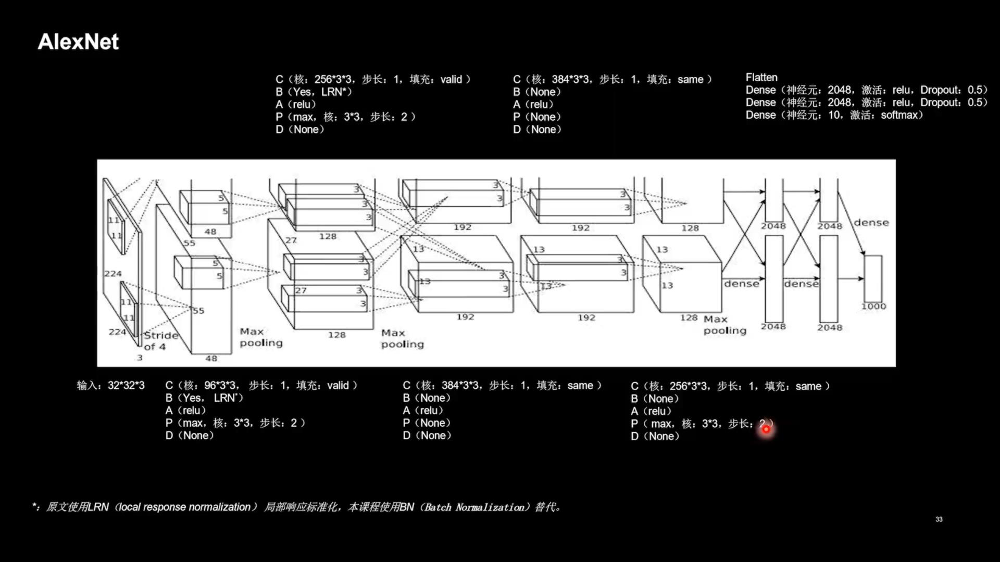

# 几种网络的 CIFATR-10 数据集分类学习

## 参考

[【北京大学】Tensorflow2.0](https://www.bilibili.com/video/BV1B7411L7Qt)

[Tensorflow API](https://tensorflow.google.cn/versions)

## 网络结构





## 目录树
```
│  cifar_cls.py      # 分类代码
|  cifar_predict.py  # 图片预测代码
│  README.md
|
├─backbone           # 网络
│      AlexNet.py
│      InceptionNet.py
│      LeNet.py
│      ResNet.py
│      Vgg.py
│      
├─loss               # 可以用来存放loss和acc图片
├─model              # 存放训练参数文件
├─NetImg             # README中使用
│      AlexNet.jpg
│      LeNet.jpg
│      VGGNet.jpg
│      简化InceptionNet.jpg
│      简化ResNet.jpg
│      
└─testimg            # 测试图片
        airplane1.jpg
        cat1.jpg     # 较难识别
        ship1.jpg
```        

## 备注
   建议先将代码中的禁用GPU代码注释掉以提高训练速度，出现 `Function call stack:predict_function` 再使用。